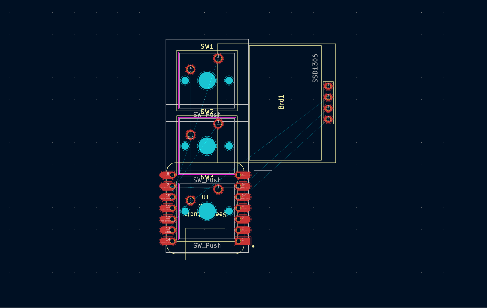

# hackpad
This respository was created by RAQuig for the project "Hackpad" by the charity Hack Club.
It is designed with three keyboard switches and USB input.
The repository currently includes:
    --> KiCAD files (.pcb, .prl, .pro, .sch, .sch-bak)
    --> 3D Print Files (.glb, .stl)
    --> QMK Configuration Files for firmware (potentially unstable release)
    --> The Bill of Materials (BOMCSV.csv)

README:
Description: This project is a very small homemade version of a Stream Deck. It has three keys that can be programmed and a small OLED display (0.91").
Why: I have always wanted to create my own technology and this project is my way in to the rest of it. I hope this project helps me learn a lot about how technology works.
How to use: Connect the USB cable to a laptop, PC, or (hopefully) console to get three keybinds to be used how I used and a OLED screen for some stats (controller battery level, FPS, Stream stats, etc.)

Photos:
    PCB: 

    Schematic: 
